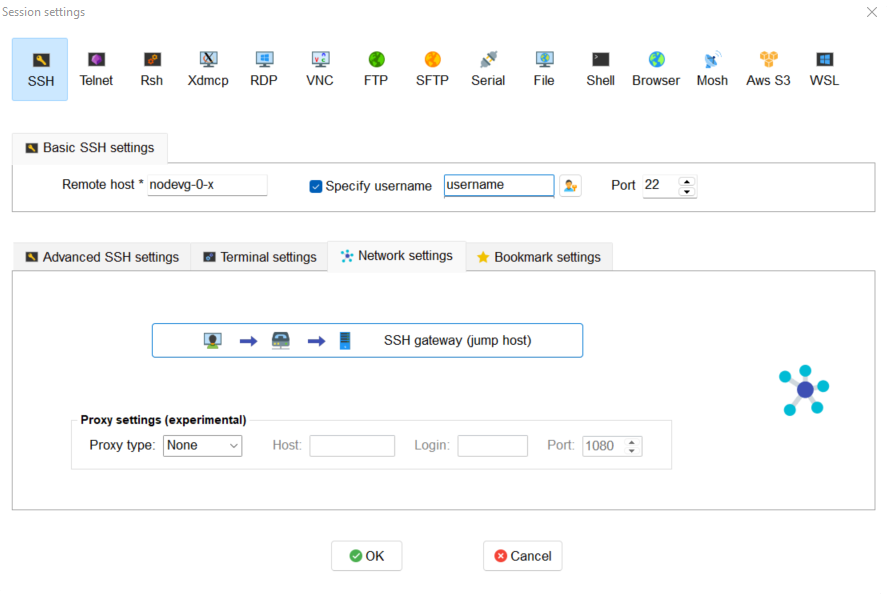

.. Questo è un commento

.. dovrebbe essere capitolo 3:
.. La seguente credo sia una reference:

.. _AccessToTheCluster:

=====================
ACCESS TO THE CLUSTER 
=====================

This section describes how to install and set-up the software needed to connect your terminal (workstation or laptop) to the cluster. 

The cluster environment is Linux OS. If you need some information on how to work in a Linux environment you may check the `Ubuntu Help <https://help.ubuntu.com/community/UsingTheTerminal>`_ or a `UNIX Tutorial <http://www.ee.surrey.ac.uk/Teaching/Unix/index.html>`_. 

The cluster’s infrastructure can be explained as following. The master node is the machine that manages all the communications between the cluster resources and the login nodes. Login nodes (*nodevg-0-x*) are the nodes used to manage the interaction between users and graphical ports and the computing nodes. When you log into the cluster you actually log into the master and then to the login nodes. In order to access the master node the user should be connected to Politecnico’s network or, if connected from outside, the user must use the `PoliMi VPN <https://www.ict.polimi.it/network/vpn/?lang=en>`_. 

.. figure:: images/cluster_structure_new.png

Figure: CFDHub hardware structure for user access. 

In order to use the computing resources the user must log in to *nodevg-0-1*, *nodevg-0-2*, *nodevg-0-3* or *nodevg-0-4* depending on your Research Group. The login nodes are distributed as following:

.. _ResearchGroups:

- *nodevg-0-1*: All research groups; 

- *nodevg-0-2*: Temporary access to old */big-scratch*;

- *nodevg-0-3*: All research groups; 

- *nodevg-0-4*: All research groups. 

*Remember:*

| **Never launch a computational run from the master!**
| **The user should be connected to the PoliMi VPN in order to access to the cluster!**
| **Always check to be connected to the selected computing nodes before to launch the run!**
| **All the processes running on the master or the login nodes will be killed without any advice if affecting the functionality of the whole system.**

|

*Note for long-term users:*

Users that used to work in login node *nodevg-0-2* should know that new login nodes **can not mount /big-scratch and /fast-scratch directories**.
These users should migrate their working directory from */big-scratch* or */fast-scratch* to the new */global-scratch* which is only available from new login nodes *nodevg-0-1*, *nodevg-0-3* or *nodevg-0-4*. To do so, it is advised to use *scp* command.

It could be also useful to know that */ARCHIVIO* directory is available from both old or new login nodes. It should just be noted that on new login nodes all the volumes in */ARCHIVIO* are mounted on demand as soon as the user access the folders and unmounted after a certain inactivity time.

.. GLOBAL SCRATCH LIMITE DOVE LAVORARE, COME MUOVERSI, FARSI CARTELLA GLOBAL E ARCHIVIO
.. dovrebbe essere capitolo 3.6:

.. _WorkingAreas:

-----------------
WORKING AREAS
-----------------
.. fare check grammatica dopo
.. check quote.
The system is divided in different working areas in order to permit a more sustainable and efficient use of the available resources.
The main working areas are reported and descrbed in the following section. Please check the relus for each working area in otder to avoid the functionality of the whole system.

**/home** |br|
*Purpose:* to save personal data such libraries, source code, compiled code, documents etc...
In general this area is reserved to files that the user think should be backed up. |br|
*Capacity:* Each user has an assigned quota of 20Gb.
This limitation exits to avoid the filling up of the **/home** area. 
To know the used space:
	| ``du -hs $HOME``
*Access:* from all nodes |br|
*Backup:* YES

.. approx. 6Tb to 30Tb on SSD (high speed) cache disk interfaces (normal) NLSAS disks to speed up data exchange processes.
**/global-scratch/bulk_pool** |br|
*Purpose:*  to launch production runs, data manipulation, elaboration, production etc... In order to preserve the purpose of this area and avoid a filling
up of the area all data older than 50 days will be deleted from this area. Please be careful and move your data to **/ARCHIVIO** area when they are not on use anymore. |br| 
*Capacity:* Each user has an assigned quota of 100Gb. To know the total quota and the actual available quota:
	| ``beegfs-ctl --mount=/global-scratch --getquota --uid $USER --storagepoolid=1``
*Access:* from all login nodes. |br|
*Backup:* NO

.. ri-chiedere a Luigi. Era qualcosa come una decina di giga per elaborare velocemente i data (tipo ML)
**/global-scratch/flash_pool** |br|
*Purpose:* to launch data manipulation, production, elaboration etc... when fast read/wirte speed is crucial for the task. |br|
*Capacity:* Each user has an assigned quota of 10Gb. To know the total quota and the actual available quota:
	| ``beegfs-ctl --mount=/global-scratch --getquota --uid $USER --storagepoolid=2``
*Access:* from all login nodes. |br|
*Backup:* NO

**/ARCHIVIO** |br|
*Purpose:* save the results and data you want to keep for long term. This area permits to store data without affecting the running processes in other working areas. |br|
*Capacity:* related to the amount of storage purchased by your Research Group, divided into blocks of 8Tb. |br|
*Access:* from all nodes. |br|
*Backup:* NO, however considered reliable being residing on enterprise band hard-drives with multi-disk data redundancy.
	
.. dovrebbe essere capitolo 3.1:
-----------------
CONNECTION REQUIREMENTS 
-----------------

The CFDHub HPC can be accessed in two ways : 

- directly from PoliMi network (e.g. polimi-protected/eduroam wifi networks or wired network); 
- from VPN service; 

The latter method is used when the user is outside the PoliMi network. Please refer to the `VPN guide <https://www.ict.polimi.it/network/vpn/?lang=en>`_ to set-up the VPN connection. 

.. dovrebbe essere capitolo 3.2:
-----------------
VPN SERVICE ACTIVATION
-----------------

To access the CFDHub HPC machines when the user is outside PoliMi network, you are required to ask your own Department IT staff the activation of VPN service for your PoliMi account. Some indications are reported at the following link: https://www.asict.polimi.it/en/network-services/vpn.html 

.. dovrebbe essere capitolo 3.3:

.. _SshConnectionAll:

-----------------
STEPS FOR HPC ACCESS
-----------------

**The very first time you access to the cluster** you should follow the instructions reported in chapter :ref:`SSH connection (Linux/MacOS)<SshConnectionLinuxMacOs>`.
Then you need to wait 15 minutes for the propagation of the password through the system.

If you access the cluster from a Windows machine, jump to the chapter :ref:`SSH connection (Windows users) <SshConnectionWindows>`. 

If you access the cluster from a Linux OS/MacOS, you can jump to next chapter :ref:`SSH connection (Linux/MacOS)<SshConnectionLinuxMacOs>`. 

.. dovrebbe essere capitolo 3.4:

.. _SshConnectionWindows:

-----------------
SSH CONNECTION (Windows)
-----------------

If you are accessing from a Windows machine, the steps to access the HPC machines (through both PoliMi network or VPN service) are:

1. :ref:`installation of the software to access the cluster<SoftwareRequirements>`; 
2. :ref:`setting of SSH session to access the cluster<DetailedSshConnctionSettings>`; 
3. :ref:`creation of the graphical port for remote control of the cluster and use of VNC tool<CreationOfAGraphicalPort>`;
4. :ref:`setting of a VNC session to graphically access and control the HPC machines<SettingOfVncSession>`; 
5. :ref:`settings to upload and download files to/from HPC machines to the local one<DataTransferWindows>`. 

.. dovrebbe essere capitolo 3.4.1:

.. _SoftwareRequirements:

__________________________________
SOFTWARE REQUIREMENTS
__________________________________

Download and install the software MobaXterm_. The next guide is referred to this software. 

An alternative and quick solution is Putty_. The user should know how to configure this software.

.. _MobaXterm: https://mobaxterm.mobatek.net/download.html 
.. _Putty: https://www.chiark.greenend.org.uk/~sgtatham/putty/latest.html

.. dovrebbe essere capitolo 3.4.2:

.. _DetailedSshConnctionSettings:

__________________________________
DETAILED SSH CONNECTION SETTINGS 
__________________________________

Open MobaXterm software:

1. Go to *Sessions* Tab –> *New Session* –> choose *SSH* and open the *Network settings* panel

2. Set up **Basic SSH settings** as described in Figure. Use your ``<username>`` and *nodevg-0-x*, where *x = 3,4* based on your :ref:`Research Group<ResearchGroups>` 

3. Set up the SSH session as described in next Figure for **SSH gateway (jump host)** voice. Use your ``<username>`` and *nodevg-0-x*, where *x = 3,4* based on your :ref:`Research Group<ResearchGroups>`. Click OK to save

4. Click OK to save the session.

.. dovrebbe essere capitolo 3.4.3:

.. _CreationOfAGraphicalPort:

__________________________________
CREATION OF A GRAPHICAL PORT 
__________________________________

Open the previously created SSH session from the left lateral bar: 

In the SSH terminal digit: 

	| ``vncserver -name <username> -geometry 0000x0000 -depth 24``

where: 

- *0000x0000* is the resolution of the monitor you use to work, for example if the user wants to work with a *1920 x 1080* resolution, the command should be changed as follows:

	``vncserver -name <username> -geometry 1920x1080 -depth 24``

After launching the previous command, the following message is presented:

	| ``New '<username>' desktop is nodevg-0-x:NN`` 
	|
	| ``Starting applications specified in /home/<research_group>/<username>/.vnc/xstartup`` 
	|
	| ``Log file is /home/<research_group>/<username>/.vnc/nodevg-0-x:NN.log`` 

The graphical port assigned to the user is indicated by the system, in this example the assigned port is *NN*. 

.. dovrebbe essere capitolo 3.4.4:

.. _SettingOfVncSession:

__________________________________
SETTING OF VNC SESSION
__________________________________

1. Go to *Sessions* Tab –> *New Session* –> choose *VNC* and open the *Network settings* panel 

2. Set up **Basic VNC settings** as described in Figure. Use your *nodevg-0-x*, where *x = 3,4* based on your :ref:`Research Group<ResearchGroups>` and the port number provided by the system in :ref:`the previous step<CreationOfAGraphicalPort>` putting it after the number *59* (e.g. if the assigned port is *NN*, put *59NN* instead of *5900*); 

3. Set up the VNC session as described in next Figure for **SSH gateway (jump host)** voice. Use your ``<username>`` and *nodevg-0-x*, where *x = 3,4* based on your :ref:`Research Group<ResearchGroups>`. Click OK to save. 

4. Click OK to save the session

.. dovrebbe essere capitolo 3.5:

.. _SshConnectionLinuxMacOs:

-----------------
SSH CONNECTION (Linux/MacOS)
-----------------

First connect to SSH server *131.175.56.199* through Port *22*. Then to start working on the cluster, it is necessary to connect to the login nodes *nodevg-0-3* or *nodevg-0-4*, depending on your :ref:`Research Group<ResearchGroups>`.

**IMPORTANT: During the very first access, the system will ask you to change your password.
At the password change prompt request, insert the temporary password provided by the administrator and than the new password (which must be fillet two times for verification purpose)**

**Be carefull because the password characters inserted are not shown at all, so be sure that the string you filled or copied is correct. If you are not sure, close the terminal and open it again. Remenber that three wrong password change attempts will lock your user.**

If the password change is needed nomore, you will than get the bash prompt.

.. dovrebbe essere capitolo 3.5.1:
__________________________________
Access from terminal
__________________________________

This method enables the user to access the cluster just from terminal, without graphical interface. For Linux/MacOS users the command, from terminal, to access the master node is: 

	| ``ssh <username>@131.175.56.199``

then to access your login node you may choose 

	| ``ssh nodevg-0-x`` 

where *x = 3,4* depending on your :ref:`Research Group<ResearchGroups>`. 

For data transferring between cluster and your local machine, refer to chapter :ref:`Data transferring for Linux/MacOS<DataTransferLinuxMacOs>`. 

.. dovrebbe essere capitolo 3.5.2:
__________________________________
Access with VNC remote desktop (MacOS)
__________________________________

This method enables the user to access the cluster with a VNC-based remote desktop window. 

.. Note: if you are using Linux OS, TurboVNC utility is required.
.. Note: if you are using Linux OS, Remmina utility is required. In user friendly Linux distribution Remmina comes pre-installed, however 

Open a terminal and type: 

	| ``ssh -L 59yy:nodevg-0-x:59yy -J <username>@131.175.56.199 <username>@nodevg-0-x`` 

where *yy* is the the :ref:`user-specific graphic port<CreationOfAGraphicalPort>`, *x = 3,4* depending on your :ref:`Research Group<ResearchGroups>`. Enter your login password when asked. 

.. To access the VNC desktop follow these steps depending on your operating system: 

Open Safari browser, type in the adress bar: **vnc://localhost:59yy** where *yy* is the the :ref:`user-specific graphic port<CreationOfAGraphicalPort>`. Enter your login password when asked. 

.. **MacOS**: Open Safari browser, type in the adress bar: **vnc://localhost:59yy** where *yy* is the the :ref:`user-specific graphic port<CREATION_OF_A_GRAPHICAL_PORT>`. Enter your login password when asked. 

.. dovrebbe essere capitolo 3.5.3:
__________________________________
Access with VNC remote desktop (Linux)
__________________________________

For this method the Remmina utility is required. In user friendly Linux distribution as Ubuntu, Remmina could come pre-installed.
However for Ubuntu it is possibile to follow this guide_ to install it. For other distributions follow this link_.

.. _guide: https://ubuntu.com/tutorials/access-remote-desktop#1-overview
.. _link: https://remmina.org/how-to-install-remmina/

1. Open Remmina from the GUI or from the terminal by typing:

	| ``remmina``

2. Create a new session by selecting the icon as shown in next figure:

3. Select form the *Protocol* drop down menu the voice **Remmina VNC Plugin**. Select *Basic* tab. In *Server* voice put your login node, where *x = 3,4* depending on your :ref:`Research Group<ResearchGroups>`, followed by ":59NN", where *NN* is the the :ref:`user-specific graphic port<CreationOfAGraphicalPort>`, as can be seen in next figure. Complete with your ``<username>`` and ``<password>``. For the *Color depth* and *Quality* follow the instructions in next figure.

4. Select *SSH Tunnel* tab. Enable SSH Tunnel by click on it. Select *Custom* voice and complete with *131.175.56.199:22*. Put your ``<username>`` and ``<password>`` on their respective voices. In next figure the user could find an example:

5. Click on *Save*. The configuration is ended and saved, you should be able to enter to your graphical port just by clicking on the new created session. 

.. dovrebbe essere capitolo 3.7:

.. _DataTransfer:

.. -----------------
.. DATA TRANSFERRING
.. -----------------

.. Depending on the OS used by the user, the procedure change as follows. 

.. dovrebbe essere capitolo 3.8:

.. _DataTransferWindows:

-----------------
DATA TRANSFERRING (Windows)
-----------------

To transfer data between the user local folders and cluster folders is necessary first to setup a tunnel and then to connect to the cluster through it. 

.. dovrebbe essere capitolo 3.8.1:
__________________________________
TUNNELLING SETUP
__________________________________

Open MobaXterm: 

1. Go to *Tunneling* Tab –> *New SSH tunnel* –> *Local port forwarding* 

2. Set-up *Local port forwarding* as indicated in the figure below. Use your ``<username>`` and *nodevg-0-x*, where *x = 3,4* based on your :ref:`Research Group<ResearchGroups>`. Click *“Save”* to close the setup window.

3. The tunnel setup is completed, click *“Exit”* to end the procedure.

Now the user has two alternatives to transfer data between local and cluster folders.

.. dovrebbe essere capitolo 3.8.2:
__________________________________
DATA TRANSFER SETUP (MobaXterm) 
__________________________________

1. Open tab *Tunnelling* and run the symbol play of the previously created tunnel as can be seen in next Figure. 

2. Close *MobaSSHTunnel* window.  

3. Go to *Sessions* Tab –> *New Session* –> choose *SFTP* 

.. AGGIORNARE INDIRIZZO IP DELL'HOST 

4. Set up **Basic Sftp settings**: insert host 127.0.0.1, your ``<username>`` and port **22**. 

5. Click OK to save the session. If asked insert your ``<password>``. 

6. Once you inserted your user data and accessed to the cluster, you will see in the left side your local folders and in the right side the cluster folders. To transfer (copy) data just drag files from one side to the other. 

.. dovrebbe essere capitolo 3.8.3:
__________________________________
DATA TRANSFER SETUP (MobaXterm + FileZilla)
__________________________________

If the user prefers to use FileZilla, it is possible to establish the tunnel connection with MobaXterm and then to use FileZilla just for data transferring. 

Open MobaXterm:

1. Open tab *Tunnelling* and run the symbol play of the previously created tunnel as can be seen in next Figure. 

2. Close *MobaSSHTunnel* window. Do not close MobaXterm.

Open FileZilla:

.. AGGIORNARE INDIRIZZO IP DELL'HOST 

3. Insert host *127.0.0.1*, your ``<username>``, your ``<password>`` and port *22*. 

4. Click *“Quickconnect”*. Once you inserted your user data and accessed to the cluster, you will see in the left side your local folders and in the right side the cluster folders. To transfer (copy) data just drag files from one side to the other. 

.. dovrebbe essere capitolo 3.9:

.. _DataTransferLinuxMacOs:

-----------------
DATA TRANSFERRING (Linux/Mac OS)
-----------------
__________________________________
Direct data transferring form terminal
__________________________________
In order to transfer files from your terminal to the cluster and vice versa, you may use the scp command from Linus OS. 

	| ``scp <sourceDir> <targetDir>``
	| ``scp <localFile> <username>@131.175.56.199:<remoteDirectory>`` 
	| ``scp <username>@131.175.56.199:<remoteFile> <localDirectory>`` 
	| ``scp -r <localDirectory> <username>@131.175.56.199:<remoteDirectory>``
	| ``scp -r <username>@131.175.56.199:<remoteDirectory> <localDirectory>``

.. _dovrebbe essere capitolo 3.9.1:
__________________________________
Filezilla
__________________________________
In order to use Filezilla for file transferring, the user needs to type the following command in the terminal:

	| ``ssh -L 2200:nodevg-0-x:22 -J <username>@131.175.56.199 <username>@nodevg-0-x`` 
	
where *x = 3,4* depending on your :ref:`Research Group<ResearchGroups>`. This enable the local port 2200 for sftp protocol.

Then, in Filezilla, connect to the cluster with the following settings:

- *Host*: sftp://localhost

- *Username*: <username>

- *Password*: user password

- *Port*: 2200

Click connect and you can now access the local directories on the left branch and the remote ones on the right one.

      
      
      
      
      
      
      
      
      
      
      
      
      

.. _UserManagement:

-----------------
USER MANAGEMENT
-----------------
In this section some basic Linux OS concepts will be explained with the aim of teaching to the user how to manage the working area for personal work.
After logging in to a login node, the user is directed to his *personal* home directory, which is a subdirectory of the **/home** partition. |br|
The user can check which path he is located in by typing in the terminal:

	| ``pwd``

Something like this will be displayed:

	| ``/home/<research group>/<username>``

If the user wants to work in the **/global-scratch/bulk_pool** partition for example, it is first necessary to create a personal directory. |br|
In order to move to another path, the user should use the *"cd"* command followed by the path the user wants to reach:

	| ``cd /global-scratch/bulk_pool``
	
Now the user can create a personal directory where the user could work, following the limitation previously exposed. |br|
In order to create a directory, the user should use the *"mkdir"* command followe by the name of the directory:

	| ``mkdir <username>``
	
Now the user can go to the fresh new directory using the *"cd"* command. The creation of the personal directory on a partition is a one-time operation.
Each user should work in his own personal directory. |br|
If the user needs to come back to personal home, the *"cd"* command must be followed by nothing:

	| ``cd``
	
If the user needs to work in other partitions (**/global-scratch/flash_pool**, **/ARCHIVIO**, others...), it is possibile to repeat this procedure to create a
new personal directory.

The user can create shortcuts in the *.bashrc* file in order to have a faster experience. This file is located in the *personal* home but is a *hidden* file.
In order to see what is contained in a path the command *ls* is used:
	| ``ls``
However, this command doesn't show hidden files as *.bashrc*. The *ls* command should be used by adding a flag. |br|
In the personal home, launch:
	| ``ls -a``	
All files are displayed and is possible to see the *.bashrc*.
The *.bashrc* is a list of commands, variables and aliases that are launched when the user logs in to a node and opens a terminal window. |br|

To check the space used in the **/global-scratch/** partition, it is possible to use the following command:

	| ``beegfs-ctl --getquota --uid $USER``

It is possible to create a **variable** to avoid the typing of a long path. For example, if the user wants to move to its personal directory in 
**/global-scratch/bulk_pool** partition, it is possible to create a *variable* to directly access it without typing the entire path in the terminal.
To edit with a graphical text editor the bashrc the user can use *gedit* (an advanced user could use *vim* or another terminal editor):

	| ``gedit .bashrc``
At the end of the *.bashrc* file it is possible to write the name of the variable and the substituted path:

	| EXAMPLE="/global-scratch/bulk_pool/<username>"
	
The the user should update the terminal:

	| ``source .bashrc``
	
Now, in order to move to the personal directory in the **/global-scratch/bulk_pool** partition, instead of:

	| ``cd /global-scratch/bulk_pool/<username>``
	
It is possible to use:

	| ``cd $EXAMPLE``

It is also possible to create an **alias** which could be used to launch a command with a long syntax. For example, it is possible to create an *alias*
to move to my personal directory in the **/global-scratch/bulk_pool** partition. |br|
As previously showed, at the end of the *.bashrc* file I can write:

	| alias EXAMPLE='cd /global-scratch/bulk_pool/<username>'
	
Now, after sourcing the bashrc, instead of:

	| ``cd /global-scratch/bulk_pool/<username>``
	
It is possible to use:

	| ``EXAMPLE``

This command could be useful for example if the *executable file* of a program is located in a directory whose path is very long and the user wants to avoid typing the complete path each time this file is needed.

For people of User Group "meccanica" it is possible to source some useful aliases, by sourcing *bash_dmec* in the */software/environment/dmec* folder. You may add

	| ``source /software/environment/dmec/bash_dmec``

to your *.bashrc* in the *$HOME* folder.

.. _TroubleShooting:

-----------------
TROUBLESHOOTING
-----------------
In this section some best practices will be presented, in order to avoid common problems. |br|

In the *.bashrc* it is possible to launch commands in order to start some softwares or source an environment or library, for example, directly when the use logs in to the cluster.
However, this procedure is not recommended because could cause compatibility issues with some pre-loaded libraries.  |br|
**Keep your .bashrc file as clean as possible**.
If you need to launch a software, source an environment or library just do it from the terminal or create a separate file (*.aliases* as an example) to be sourced after login. |br| 

It is possible that a process launched by the user crashes but continues to run in background. When this happens, the user could *kill* the process from the terminal. |br| 
First the user should identify the process by typing in the terminal:

	| ``htop -u <username>``
	
All the process lanched by the user in the node are displayed. Then the user should identify the process to *kill* by the *PID* number displayed on the left column.
To close the **htop** use the shortcut **ctrl+C**. |br|
In order to kill that process:

	| ``kill -9 <PID number>``
	
It is possible for various reasons, that the user cannot log in a login node after the jump from master node.
In this case the user is logged in the *master node* and not in a *login node* (for example nodevg-0-4). |br|
If this happens it is shown in the terminal:

	| [<username>@master ~]$
	
Instead of:

	| [<username>@nodevg-0-4 <username>]$
	
If this happens, **DO NOT LAUNCH ANY PROCESS**. The computational power of the master node is sufficient to manage all the cluster's users logins but not to launch any type of simulation, data manipulation or other tasks.

The user should use **just one graphical window** at time, if more than one window is used the system admin could choose to close all the graphical ports.
This could lead to losing all the work in progress in graphical windows. |br|
Next it will be explained how to check if and how many graphical ports are running. |br|
In the terminal type:

	| ``ps -eo pid,ruser=RealUser -o cmd | grep <username> | grep /bin/Xvnc | grep -v "grep"``
	
The list of all running graphical windows will be displayed, in this example the user has two running graphical port:
	
	| PID1 <username>   /usr/bin/Xvnc :NN -auth /home/<research_group>/<username>/.Xauthority etc...
	| PID2 <username>   /usr/bin/Xvnc :NM -auth /home/<research_group>/<username>/.Xauthority etc...

For each graphical port, the corresponding PID is displayed in the first column. |br|
After *"/usr/bin/Xvnc"* the number of the graphical port is listed. |br|
In this example the user has two graphical port: **NN** and **NM**.
If the user is working in the **NN** graphical window and has opened by accident the **NM** port, the corresponding process should be killed:

	| ``kill -9 PID2``
	
Giving a new check, just the desired graphical window should be displayed:

	| PID1 <username>   /usr/bin/Xvnc :NN -auth /home/<research_group>/<username>/.Xauthority etc...

It could happen that the graphical windows are closed for several reasons as cluster shutdown, maintenance or other problems.
If the user is using MobaXTerm, an error like the following one could be displayed:

.. figure:: images/errore_VNC_moba.png

In this case the user should check, following the previous indications, if the graphical port is running. If no PID and port number is displayed, the user should repeat :ref:`the creation of the graphical port<CreationOfAGraphicalPort>`.

.. per fare i break volontari con |br| a fine linea, lasciare in fondo al file:
.. |br| raw:: html

       
