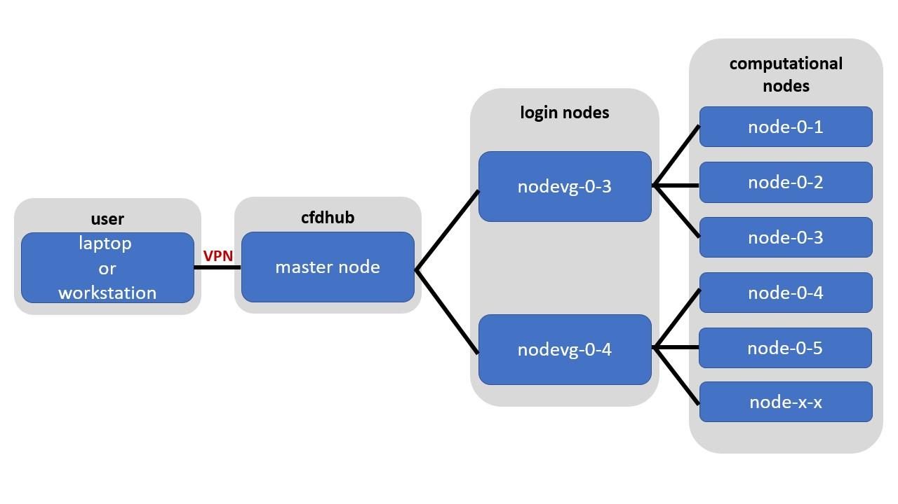
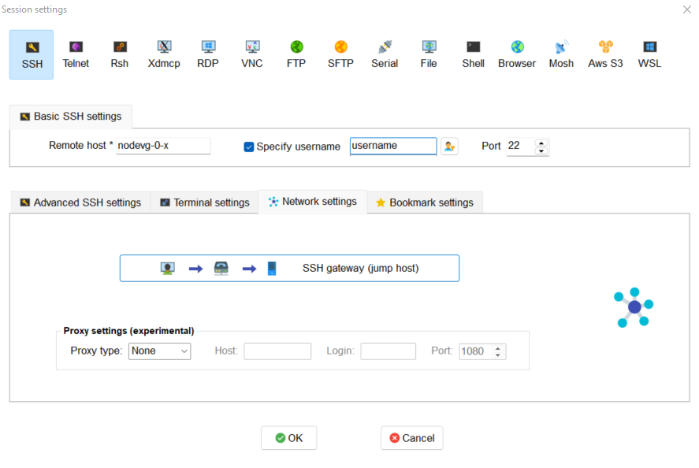
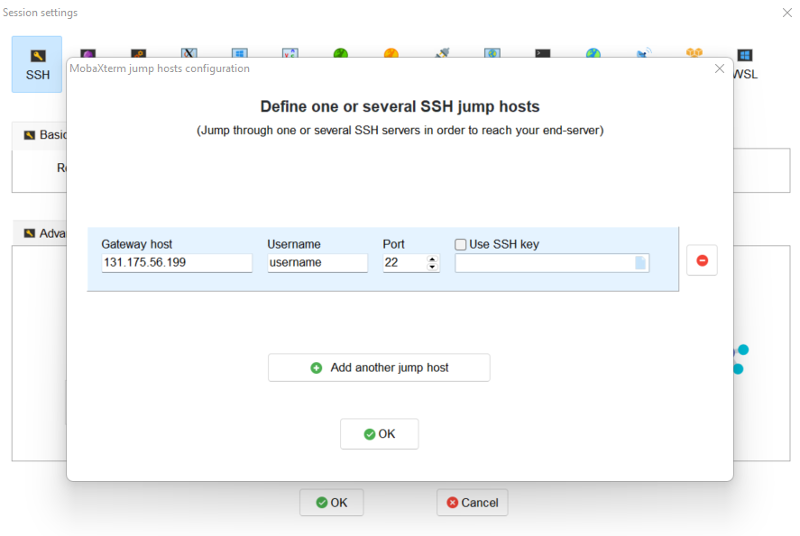
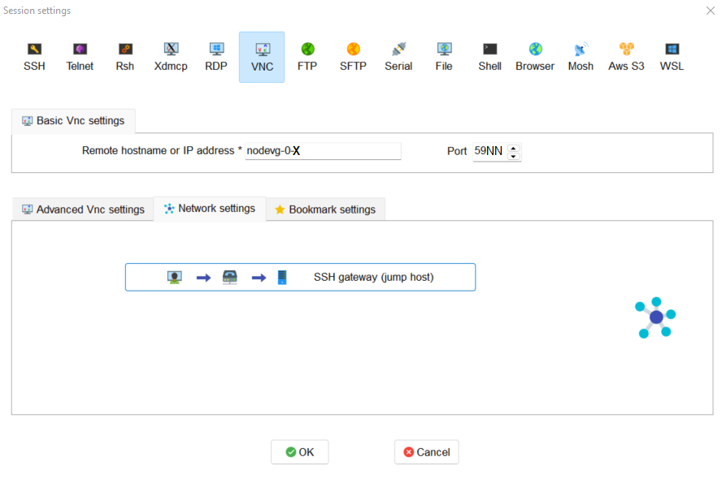
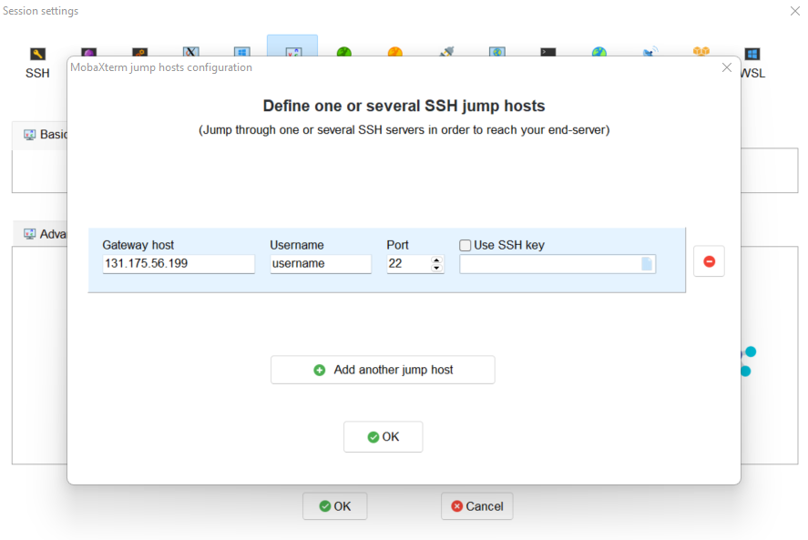
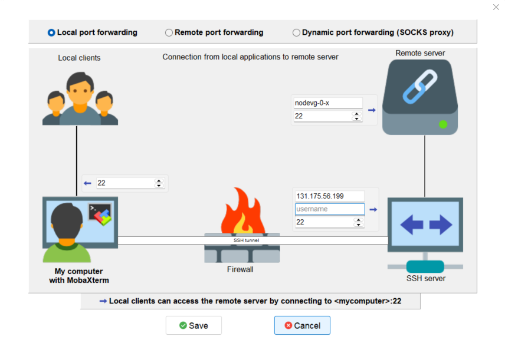
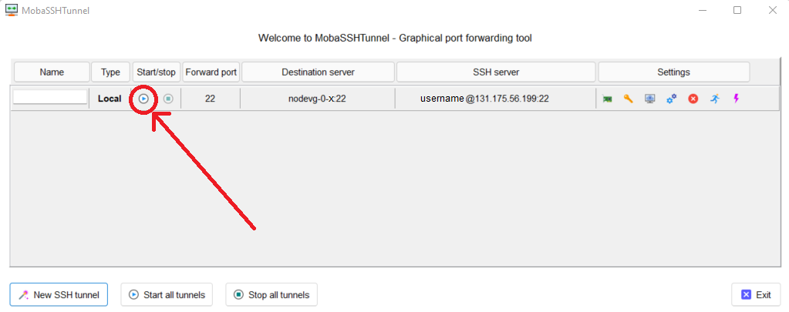

.. Questo è un commento

.. dovrebbe essere capitolo 3:
.. La seguente credo sia una reference:
.. _AccessToTheCluster
=====================
ACCESS TO THE CLUSTER 
=====================

This section describes how to install and set-up the software needed to connect your terminal (workstation or laptop) to the cluster. 

The cluster environment is Linux OS. If you need some information on how to work in a Linux environment you may check the `Ubuntu Help <https://help.ubuntu.com/community/UsingTheTerminal>`_ or a `UNIX Tutorial <http://www.ee.surrey.ac.uk/Teaching/Unix/index.html>`_. 

The cluster’s infrastructure can be explained as following. The master node is the machine that manages all the communications between the cluster resources and the login nodes. Login nodes (*nodevg-0-x*) are the nodes used to manage the interaction between users and graphical ports and the computing nodes. When you log into the cluster you actually log into the master and then to the login nodes. In order to access the master node the user should be connected to Politecnico’s network or, if connected from outside, the user must use the `PoliMi VPN <https://www.ict.polimi.it/network/vpn/?lang=en>`_. 

Figure: CFDHub hardware structure for user access. 

In order to use the computing resources you will have to log into *nodevg-0-3* or *nodevg-0-4* (depending on your :ref:`Research Group<ResearchGroups>`) to successively use the computational resources. 

| *Remember:*
| **Never launch a computational run from the master!**
| **The user should be connected to the PoliMi VPN in order to access to the cluster!**
| **Always check to be connected to the selected computing nodes before to launch the run!**
| **All the processes running on the master or the login nodes will be killed without any advice if affecting the functionality of the whole system.**

| *Note for longstanding user:*
Users that used to work in login nodes *nodevg-01* and *nodevg-02* should know that new login nodes **cannot "see" /big-scratch and /fast-scratch directories**.
These users should migrate their working directory from */big-scratch* or */fast-scratch* to the new */global-scratch* which is only available from new login nodes *nodevg-03* or *nodevg-04*.
It could be useful to know that */ARCHIVIO* directory is available from old or new login nodes.

.. dovrebbe essere capitolo 3.1:
-----------------
CONNECTION REQUIREMENTS 
-----------------

The CFDHub HPC can be accessed in two ways : 

- directly from PoliMi network (e.g. polimi-protected/eduroam wifi networks or wired network); 
- from VPN service; 

The latter method is used when the user is outside the PoliMi network. Please refer to the `VPN guide <https://www.ict.polimi.it/network/vpn/?lang=en>`_ to set-up the VPN connection. 

.. dovrebbe essere capitolo 3.2:
-----------------
VPN SERVICE ACTIVATION
-----------------

To access the CFDHub HPC machines when the user is outside PoliMi network, you are required to ask your own Department IT staff the activation of VPN service for your PoliMi account. Some indications are reported at the following link: https://www.asict.polimi.it/en/network-services/vpn.html 

.. dovrebbe essere capitolo 3.3:
-----------------
STEPS FOR HPC ACCESS
-----------------

If you access the cluster from a Windows machine, jump to the chapter :ref:`SSH connection (Windows users) <SSH_CONNECTION_Windows>`. 

If you access the cluster from a Linux OS/MacOS, you can jump to next chapter :ref:`SSH connection (LINUX/MacOS)<SSH_CONNECTION_Linux_Mac-OS>`. 

.. dovrebbe essere capitolo 3.4:
.. _SSH_CONNECTION_Windows:
-----------------
SSH CONNECTION (Windows)
-----------------

If you are accessing from a Windows machine, the steps to access the HPC machines (through both PoliMi network or VPN service) are:

1. :ref:`installation of the software to access the cluster<SOFTWARE_REQUIREMENTS>`; 
2. :ref:`setting of SSH session to access the cluster<DETAILED_SSH_CONNECTION_SETTINGS>`; 
3. :ref:`creation of the graphical port for remote control of the cluster and use of VNC tool<CREATION_OF_A_GRAPHICAL_PORT>`;
4. :ref:`setting of a VNC session to graphically access and control the HPC machines<SETTING_OF_VNC_SESSION>`; 
5. :ref:`settings to upload and download files to/from HPC machines to the local one<DATA_TRANSFER_WINDOWS>`. 

.. dovrebbe essere capitolo 3.4.1:
.. _SOFTWARE_REQUIREMENTS:
__________________________________
SOFTWARE REQUIREMENTS
__________________________________

Download and install the software MobaXterm_. The next guide is referred to this software. 

An alternative and quick solution is Putty_. The user should know how to configure this software.

.. _MobaXterm: https://mobaxterm.mobatek.net/download.html 
.. _Putty: https://www.chiark.greenend.org.uk/~sgtatham/putty/latest.html

.. dovrebbe essere capitolo 3.4.2:
.. _DETAILED_SSH_CONNECTION_SETTINGS:
__________________________________
DETAILED SSH CONNECTION SETTINGS 
__________________________________

Open MobaXterm software:

1. Go to *Sessions* Tab –> *New Session* –> choose *SSH* and open the *Network settings* panel

2. Set up **Basic SSH settings** as described in Figure. Use your ``<username>`` and *nodevg-0-x*, where *x = 3,4* based on your :ref:`Research Group<ResearchGroups>` 

3. Set up the SSH session as described in next Figure for **SSH gateway (jump host)** voice. Use your ``<username>`` and *nodevg-0-x*, where *x = 3,4* based on your :ref:`Research Group<ResearchGroups>`. Click OK to save

4. Click OK to save the session.

.. dovrebbe essere capitolo 3.4.3:
.. _CREATION_OF_A_GRAPHICAL_PORT:
__________________________________
CREATION OF A GRAPHICAL PORT 
__________________________________

Open the previously created SSH session from the left lateral bar: 

In the SSH terminal digit: 

	| ``vncserver -name <username> -geometry 0000x0000 -depth 24``

where: 

- *0000x0000* is the resolution of the monitor you use to work, for example if the user wants to work with a *1920 x 1080* resolution, the command should be changed as follows:

	``vncserver -name <username> -geometry 1920x1080 -depth 24``

After launching the previous command, the following message is presented:

	| ``New '<username>' desktop is nodevg-0-x:NN`` 
	|
	| ``Starting applications specified in /home/<research_group>/<username>/.vnc/xstartup`` 
	|
	| ``Log file is /home/<research_group>/<username>/.vnc/nodevg-0-x:NN.log`` 

The graphical port assigned to the user is indicated by the system, in this example the assigned port is *NN*. 

.. dovrebbe essere capitolo 3.4.4:
.. _SETTING_OF_VNC_SESSION:
__________________________________
SETTING OF VNC SESSION
__________________________________

1. Go to *Sessions* Tab –> *New Session* –> choose *VNC* and open the *Network settings* panel 

2. Set up **Basic VNC settings** as described in Figure. Use your *nodevg-0-x*, where *x = 3,4* based on your :ref:`Research Group<ResearchGroups>` and the port number provided by the system in :ref:`the previous step<CREATION_OF_A_GRAPHICAL_PORT>` putting it after the number *59* (e.g. if the assigned port is *NN*, put *59NN* instead of *5900*); 

3. Set up the VNC session as described in next Figure for **SSH gateway (jump host)** voice. Use your ``<username>`` and *nodevg-0-x*, where *x = 3,4* based on your :ref:`Research Group<ResearchGroups>`. Click OK to save. 

4. Click OK to save the session

.. dovrebbe essere capitolo 3.5:
.. _SSH_CONNECTION_Linux_Mac-OS:
-----------------
SSH CONNECTION (Linux/Mac OS)
-----------------

First connect to SSH server *131.175.56.199* through Port *22*. Then to start working on the cluster, it is necessary also to connect to the login nodes *nodevg-0-3* or *nodevg-0-4*, depending on your Research Group. 

.. verificare se i nodi sono cosi assegnati, VERIFICARE GLI IP 

- *nodevg-0-3* (*10.0.0.235*) Research groups of Chemical, Mathematical and Mechanical Engineering Departments; 

- *nodevg-0-4* (*10.0.0.236*) Research groups of Energy, Electronic-BioEngineering and not mentioned Departments. 

.. dovrebbe essere capitolo 3.5.1:
__________________________________
Access from terminal
__________________________________

This method enables the user to access the cluster just from terminal, without graphical interface. For Linux/MacOS users the command, from terminal, to access the master node is: 

	| ``ssh <username>@131.175.56.199``

then to access your login node you may choose 

	| ``ssh nodevg-0-x`` 

where *x = 3,4* depending on your :ref:`Research Group<ResearchGroups>`. 

For data transferring between cluster and your local machine, refer to chapter :ref:`Data transferring for Linux/MacOS<DATA_TRANSFER_Linux_Mac-OS>`. 

.. dovrebbe essere capitolo 3.5.2:
__________________________________
Access with VNC remote desktop
__________________________________

This method enables the user to access the cluster with a VNC-based remote desktop window. 

Note: if you are using Linux OS, TurboVNC utility is required. 

Open a terminal and type: 

	| ``ssh -L 59yy:nodevg-0-x:59yy -J <username>@131.175.56.199 <username>@nodevg-0-x`` 

where *yy* is the the :ref:`user-specific graphic port<CREATION_OF_A_GRAPHICAL_PORT>`, *x = 3,4* depending on your :ref:`Research Group<ResearchGroups>`. Enter your login password when asked. 

To access the VNC desktop follow these steps depending on your operating system: 

.. FINIRE e testare
Linux OS: installare turboVNC e poi??? 

**MacOS**: Open Safari browser, type in the adress bar: **vnc://localhost:59yy** where *yy* is the the :ref:`user-specific graphic port<CREATION_OF_A_GRAPHICAL_PORT>`. Enter your login password when asked. 

.. GLOBAL SCRATCH LIMITE DOVE LAVORARE, COME MUOVERSI, FARSI CARTELLA GLOBAL E ARCHIVIO
.. dovrebbe essere capitolo 3.6:
.. _DIRECTORY_MANAGEMENT:
-----------------
DIRECTORY MANAGEMENT
-----------------

The 

.. dovrebbe essere capitolo 3.7:
.. _DATA_TRANSFER:
-----------------
DATA TRANSFERRING
-----------------

Depending on the OS used by the user, the procedure change as follows. 

.. dovrebbe essere capitolo 3.8:
.. _DATA_TRANSFER_WINDOWS:
-----------------
DATA TRANSFERRING FOR WINDOWS USERS
-----------------

To transfer data between the user local folders and cluster folders is necessary first to setup a tunnel and then to connect to the cluster through it. 

.. dovrebbe essere capitolo 3.8.1:
__________________________________
TUNNELLING SETUP
__________________________________

Open MobaXterm: 

1. Go to *Tunneling* Tab –> *New SSH tunnel* –> *Local port forwarding* 

2. Set-up *Local port forwarding* as indicated in the figure below. Use your ``<username>`` and *nodevg-0-x*, where *x = 3,4* based on your :ref:`Research Group<ResearchGroups>`. Click *“Save”* to close the setup window.

3. The tunnel setup is completed, click *“Exit”* to end the procedure.

Now the user has two alternatives to transfer data between local and cluster folders.

.. dovrebbe essere capitolo 3.8.2:
__________________________________
DATA TRANSFER SETUP (MobaXterm) 
__________________________________

1. Open tab *Tunnelling* and run the symbol play of the previously created tunnel as can be seen in next Figure. 

2. Close *MobaSSHTunnel* window.  

3. Go to *Sessions* Tab –> *New Session* –> choose *SFTP* 

.. AGGIORNARE INDIRIZZO IP DELL'HOST 

4. Set up **Basic Sftp settings**: insert host 127.0.0.1, your ``<username>`` and port **22**. 

5. Click OK to save the session. If asked insert your ``<password>``. 

6. Once you inserted your user data and accessed to the cluster, you will see in the left side your local folders and in the right side the cluster folders. To transfer (copy) data just drag files from one side to the other. 

.. dovrebbe essere capitolo 3.8.3:
__________________________________
DATA TRANSFER SETUP (MobaXterm + FileZilla)
__________________________________

If the user prefers to use FileZilla, it is possible to establish the tunnel connection with MobaXterm and then to use FileZilla just for data transferring. 

Open MobaXterm:

1. Open tab *Tunnelling* and run the symbol play of the previously created tunnel as can be seen in next Figure. 

2. Close *MobaSSHTunnel* window. Do not close MobaXterm.

Open FileZilla:

.. AGGIORNARE INDIRIZZO IP DELL'HOST 

3. Insert host *127.0.0.1*, your ``<username>``, your ``<password>`` and port *22*. 

4. Click *“Quickconnect”*. Once you inserted your user data and accessed to the cluster, you will see in the left side your local folders and in the right side the cluster folders. To transfer (copy) data just drag files from one side to the other. 

.. dovrebbe essere capitolo 3.9:
.. _DATA_TRANSFER_Linux_Mac-OS:
-----------------
DATA TRANSFERRING FOR LINUX/Mac OS
-----------------

In order to transfer files from your terminal to the cluster and vice versa, you may use the scp command from Linus OS. 

	| ``scp <sourceDir> <targetDir>``
	| ``scp <localFile> <username>@131.175.56.199:<remoteDirectory>`` 
	| ``scp <username>@131.175.56.199:<remoteFile> <localDirectory>`` 
	| ``scp -r <localDirectory> <username>@131.175.56.199:<remoteDirectory>``
	| ``scp -r <username>@131.175.56.199:<remoteDirectory> <localDirectory>``

.. _dovrebbe essere capitolo 3.9.1:
__________________________________
DATA TRANSFERRING (FileZilla)
__________________________________

