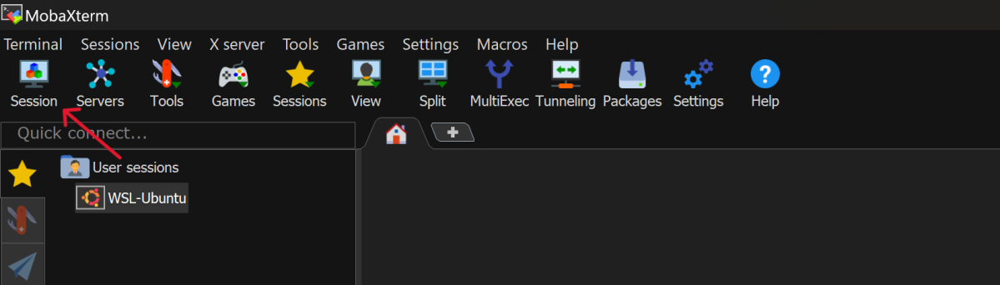
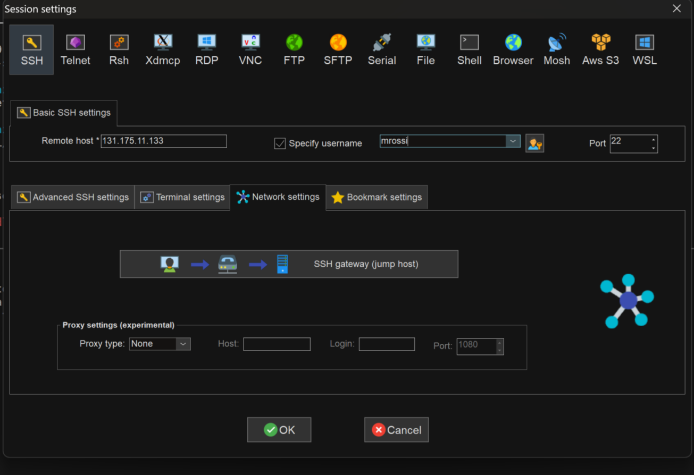
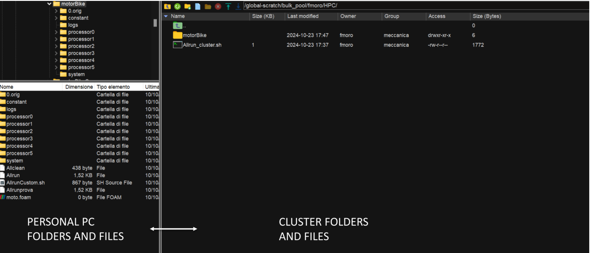

.. Questo è un commento

=====================
CFDHub side projects
=====================

There are some projects that are related to CFDHub, but dedicated to didactic purposes.

.. _Calimero:

-----------------
CALIMERO
-----------------

Calimero is a cluster that is used for teaching activity. it is composed by 3 nodes *Intel(R) Xeon(R) CPU E5-2680 0 @ 2.70GHz* with sandybridge architecture and *Rocky Linux 8*.

CONNECTION REQUIREMENTS 
-----------------

Calimero can be accessed through VPN service and VPN should be used when the user is inside or outside the PoliMi network. Please refer to the `VPN guide <https://www.ict.polimi.it/network/vpn/?lang=en>`_ to set-up the VPN connection.

VPN Installation
^^^^^^^^^^^^^^^^^

Follow the three points for the installation:

- Personal Polimi Certificate installation

- Download and installation of the GlobalProtect VPN client

- Connection to Polimi network

Procedure:
1. Connect to the `VPN portal <https://www.ict.polimi.it/network/vpn/?lang=en>`_
2. The "*Portal Address*" is: gp-deng-saml.vpn.polimi.it (Energy Department)

HOW TO ACCESS CALIMERO
-----------------

After following the instructions on how to install the vpn of the department of energy, do the following
steps:
Open Mobaxterm and open the session tab.

.. Figure: CFDHub hardware structure for user access. 

Go in the SSH session setting.
In Basic SSH settings insert as remote host ``131.175.11.133``
Flag the specify username option and insert the first letter of your name and your surname (es for
Mario Rossi: mrossi).

Click ok: your new session is available on the left column.

Open the session just created: you are now in the Master environment.
The very first time you access to Calimero you wil be asked to change your first access password (typically it will be the concatenation of matricola and PersonCode without spaces).
When you enter the new password the characters will not be shown.

**Important**: do not launch anything from here. Everything launched from here is stopped by default.

After changing password you need to configure your environment by copying the configuration files (do not worry if the directories are not copied):
::
    cp /etc/skel/.* ~/.

Then you may disconnect and reconnect to the cluster (the password may take some time to be updated on the entire system).

Enter ``cd /global-scratch``

The */* before *global-scratch* means that you are starting from the system root, hence this line of
code will bring you always to the global-scratch directory wherever you are when you type it.

To create your personal folder is inside the global-scratch folder: ``mkdir $USERNAME``

All simulations must be launched from the personal folder.

HOW TO TRANSFER FILES TO-FROM CALIMERO
-----------------

To access and transfer files to and from calimero, create a new SFTP session on MobaXTerm.
Insert remote host: 131.175.11.133
Insert your username

.. figure:: images/calimero_fileAccess.png

Connect to the SFTP session, you will have a column on the left with your local files and a column on the right with the server files. You can move items from one to the other by simply dragging them from one side to the other.

You can access different folders of the system by copying the absolute path.

Linux users may copy files or folders from command line using:
::
    scp localFile username@131.175.11.133:/remotefolder
    scp username@131.175.11.133:/remotefolder/remoteFile  localFolder
    scp -r localFolder username@131.175.11.133:/remotefolder
    scp -r username@131.175.11.133:/remotefolder localFolder

HOW TO LAUNCH JOBS
-----------------

To submit a OpenFOAM job using queues, prepare the launch file ``OpenFOAMJob.sh`` that will be used to run your script. Please check with your Professor what are the ``queues`` you have access to.

The result of the computation will be written on file according to what you specified in your ``system/controlDict`` file. The output will be written on the *jobOutput* file. if you wish you may redirect in another file (typically ``log.$solver``).

*If you are asking for more than one cpu, please make sure your requested cpus and the number of *processors* are coincident, so you will use all requested cpus.*

Here an example of launch file:

::

    #!/bin.bash             # use bash as command interpreter
    #$ -cwd                 # currentWorkingDirectory
    #$ -N myOpenFOAMJob     # jobName
    #$ -j y                 # merges output and errors
    #$ -S /bin/bash         # scripting language
    #$ -l h_rt=3:00:00      # jobDuration hh:mm:ss
    #$ -q all.q             # queueName
    #$ -pe mpi 4            # cpuNumber
    #---------------------------------------------------------
    
    ### LOAD THE OPENFOAM ENVIRONMENT
    module use module use /software/spack/spack/share/spack/modules/linux-rocky8-sandybridge/
    module load openfoam/2306-gcc-13.2.0-tnytlfv
    
    #---------------------------------------------------------
    
    ### EXECUTE COMMANDS
    #./Allrun
    
    blockMesh >& log.blockMesh
    decomposePar >& log.decomposePar
    mpirun --hostfile machinefile.$JOB_ID snappyHexMesh -parallel >& log.snappyHexMesh
    mpirun --hostfile machinefile.$JOB_ID simpleFoam -parallel >& log.simpleFoam
    reconstructPar -latestTime >& log.reconstructPar
    sample -latestTime >& log.sample

    echo End Parallel Run

Just add/remove *hashtags* [#] to comment/uncomment the lines. To execute the commands, you may either include an executable file (``Allrun`` in this case), or list all relevant commands.

To launch your ``OpenFOAMJob.sh`` file from the *master node*, from the ``jobDirectory`` you may execute:

``[<username>@nodevg-0-x jobDirectory]$ qsub OpenFOAMJob.sh``

To check the status of the job you may use the ``qstat -u <username>`` command to see if the job started. To check how the job is proceeding from the login node, reading the output, you may use:

``[<username>@nodevg-0-1 jobDirectory]$ tail -f log.simpleFoam``

Useful commands are:

+-----------+---------------------------------+-----------------------------+
| Command   | Description                     | Example                     |
+===========+=================================+=============================+
| ``qsub``  | Submit a job                    | ``qsub launchFile.sh``      |
+-----------+---------------------------------+-----------------------------+
| ``qstat`` | Show status of jobs             | ``qstat -u <username>``     |
+           +---------------------------------+-----------------------------+
|           | Show status of queue            |``qstat -f -q all.q``        |
+-----------+---------------------------------+-----------------------------+
| ``qdel``  | Delete a job                    | ``qdel 84249``              |
+-----------+---------------------------------+-----------------------------+
| ``qmove`` | Move a job to a different queue | ``qmove hub.72 84249``      |
+-----------+---------------------------------+-----------------------------+

To check the status of the cluster you may add to your .bashrc file the following aliases and by digiting ``check`` or ``check2`` you may control the job status:

``alias check='echo "===========RUNNING JOBS============="; echo "    ALL.Q"; qstat -q all.q -s r -u "*"; echo "    DIDA.Q"; qstat -q dida.q -s r -u "*";  echo "============PENDING JOBS=============="; echo "    ALL.Q"; qstat -q all.q -s p -u "*"; echo "    DIDA.Q"; qstat -q dida.q -s p -u "*"; echo "=============SUSPENDED JOBS============="; qstat -q all.q -s s -u "*"; qstat -q dida.q -s s -u "*"; qstat -g c | grep "QUEUE\|.q"'``
``alias check2='qstat -f -u "*"'``
