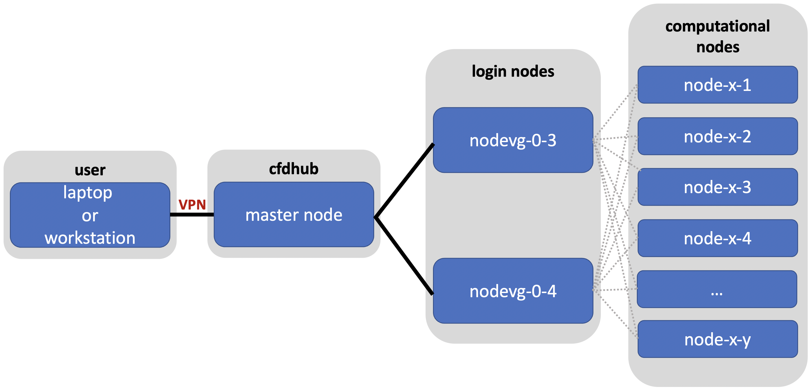

.. Questo è un commento

=====================
CFDHub side projects
=====================

There are some projects that are related to CFDHub, but dedicated to didactic purposes.

.. _Calimero:

-----------------
CALIMERO
-----------------

Calimero is a cluster that is used for teaching activity. it is composed by 3 nodes *Intel(R) Xeon(R) CPU E5-2680 0 @ 2.70GHz* with sandybridge architecture and *Rocky Linux 8*.

CONNECTION REQUIREMENTS 
-----------------

Calimero can be accessed through VPN service and VPN should be used when the user is inside or outside the PoliMi network. Please refer to the `VPN guide <https://www.ict.polimi.it/network/vpn/?lang=en>`_ to set-up the VPN connection.

VPN Installation
^^^^^^^^^^^^^^^^^

Follow the three points for the installation:
- Personal Polimi Certificate installation
- Download and installation of the GlobalProtect VPN client
- Connection to Polimi network

Procedure:
1. Connect to the `VPN portal <https://www.ict.polimi.it/network/vpn/?lang=en>`_
2. The "*Portal Address*" is: gp-deng.vpn.polimi.it (Energy Department)

.. dovrebbe essere capitolo 3.2:
-----------------
VPN SERVICE ACTIVATION
-----------------

To access the CFDHub HPC machines when the user is outside PoliMi network, you are required to ask your own Department IT staff the activation of VPN service for your PoliMi account. Some indications are reported at the following link: https://www.asict.polimi.it/en/network-services/vpn.html 

The cluster environment is Linux OS. If you need some information on how to work in a Linux environment you may check the `Ubuntu Help <https://help.ubuntu.com/community/UsingTheTerminal>`_ or a `UNIX Tutorial <http://www.ee.surrey.ac.uk/Teaching/Unix/index.html>`_. 

The cluster’s infrastructure can be explained as following. The master node is the machine that manages all the communications between the cluster resources and the login nodes. Login nodes (*nodevg-0-x*) are the nodes used to manage the interaction between users and graphical ports and the computing nodes. When you log into the cluster you actually log into the master and then to the login nodes. In order to access the master node the user should be connected to Politecnico’s network or, if connected from outside, the user must use the `PoliMi VPN <https://www.ict.polimi.it/network/vpn/?lang=en>`_. 

Figure: CFDHub hardware structure for user access. 

In order to use the computing resources the user must log in to *nodevg-0-1*, *nodevg-0-2*, *nodevg-0-3* or *nodevg-0-4* depending on your Research Group. The login nodes are distributed as following:

.. _ResearchGroups:

- *nodevg-0-1*: All research groups; 

- *nodevg-0-2*: Temporary access to old */big-scratch*;

- *nodevg-0-3*: All research groups; 

- *nodevg-0-4*: All research groups. 

*Remember:*

| **Never launch a computational run from the master!**
| **The user should be connected to the PoliMi VPN in order to access to the cluster!**
| **Always check to be connected to the selected computing nodes before to launch the run!**
| **All the processes running on the master or the login nodes will be killed without any advice if affecting the functionality of the whole system.**

|

*Note for long-term users:*

Users that used to work in login node *nodevg-0-2* should know that new login nodes **can not mount /big-scratch and /fast-scratch directories**.
These users should migrate their working directory from */big-scratch* or */fast-scratch* to the new */global-scratch* which is only available from new login nodes *nodevg-0-1*, *nodevg-0-3* or *nodevg-0-4*. To do so, it is advised to use *scp* command.

It could be also useful to know that */ARCHIVIO* directory is available from both old or new login nodes. It should just be noted that on new login nodes all the volumes in */ARCHIVIO* are mounted on demand as soon as the user access the folders and unmounted after a certain inactivity time.

.. GLOBAL SCRATCH LIMITE DOVE LAVORARE, COME MUOVERSI, FARSI CARTELLA GLOBAL E ARCHIVIO
.. dovrebbe essere capitolo 3.6:

.. _WorkingAreas:

-----------------
WORKING AREAS
-----------------
.. fare check grammatica dopo
.. check quote.
The system is divided in different working areas in order to permit a more sustainable and efficient use of the available resources.
The main working areas are reported and descrbed in the following section. Please check the relus for each working area in otder to avoid the functionality of the whole system.

**/home** |br|
*Purpose:* to save personal data such libraries, source code, compiled code, documents etc...
In general this area is reserved to files that the user think should be backed up. |br|
*Capacity:* Each user has an assigned quota of 20Gb.
This limitation exits to avoid the filling up of the **/home** area. 
To know the total quota and the actual available quota:
	| ``(TBD)``
*Access:* from all nodes |br|
*Backup:* YES

.. approx. 6Tb to 30Tb on SSD (high speed) cache disk interfaces (normal) NLSAS disks to speed up data exchange processes.
**/global-scratch/bulk_pool** |br|
*Purpose:*  to launch production runs, data manipulation, elaboration, production etc... In order to preserve the purpose of this area and avoid a filling
up of the area all data older than 50 days will be deleted from this area. Please be careful and move your data to **/ARCHIVIO** area when they are not on use anymore. |br| 
*Capacity:* Each user has an assigned quota of 100Gb. To know the total quota and the actual available quota:
	| ``beegfs-ctl --mount=/global-scratch --getquota --uid $USER --storagepoolid=1``
*Access:* from all login nodes. |br|
*Backup:* NO

.. ri-chiedere a Luigi. Era qualcosa come una decina di giga per elaborare velocemente i data (tipo ML)
**/global-scratch/flash_pool** |br|
*Purpose:* to launch data manipulation, production, elaboration etc... when fast read/wirte speed is crucial for the task. |br|
*Capacity:* Each user has an assigned quota of 10Gb. To know the total quota and the actual available quota:
	| ``beegfs-ctl --mount=/global-scratch --getquota --uid $USER --storagepoolid=2``
*Access:* from all login nodes. |br|
*Backup:* NO

**/ARCHIVIO** |br|
*Purpose:* save the results and data you want to keep for long term. This area permits to store data without affecting the running processes in other working areas. |br|
*Capacity:* related to the amount of storage purchased by your Research Group, divided into blocks of 8Tb. |br|
*Access:* from all nodes. |br|
*Backup:* NO, however considered reliable being residing on enterprise band hard-drives with multi-disk data redundancy.
