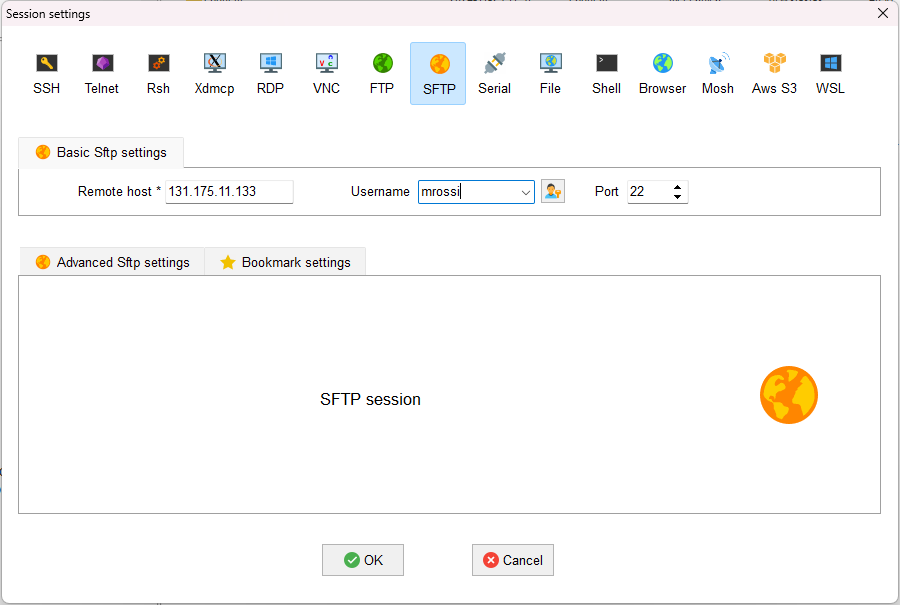

.. Questo è un commento

=====================
CFDHub side projects
=====================

There are some projects that are related to CFDHub, but dedicated to didactic purposes.

.. _Calimero:

-----------------
CALIMERO
-----------------

Calimero is a cluster that is used for teaching activity. it is composed by 3 nodes *Intel(R) Xeon(R) CPU E5-2680 0 @ 2.70GHz* with sandybridge architecture and *Rocky Linux 8*.

CONNECTION REQUIREMENTS 
-----------------

Calimero can be accessed through VPN service and VPN should be used when the user is inside or outside the PoliMi network. Please refer to the `VPN guide <https://www.ict.polimi.it/network/vpn/?lang=en>`_ to set-up the VPN connection.

VPN Installation
^^^^^^^^^^^^^^^^^

Follow the three points for the installation:
- Personal Polimi Certificate installation
- Download and installation of the GlobalProtect VPN client
- Connection to Polimi network

Procedure:
1. Connect to the `VPN portal <https://www.ict.polimi.it/network/vpn/?lang=en>`_
2. The "*Portal Address*" is: gp-deng.vpn.polimi.it (Energy Department)

HOW TO ACCESS CALIMERO
-----------------

After following the instructions on how to install the vpn of the department of energy, do the following
steps:
Open Mobaxterm and open the session tab.

.. figure:: images/calimero_sessionTab.png

.. Figure: CFDHub hardware structure for user access. 

Go in the SSH session setting.
In Basic SSH settings insert as remote host ``131.175.11.133``
Flag the specify username option and insert the first letter of your name and your surname (es for
Mario Rossi: mrossi).

.. figure:: images/calimero_sshSettings.png

Click ok: your new session is available on the left column.

Open the session just created: you are now in the Master environment

**Important**: do not launch anything from here. Everything launched from here is stopped by default.

The very first time you access to Calimero you wil be asked to change your password.
After changing password you need to configure your environment by copying the configuration files:
::
    cp /etc/skel/.* ~/.

Then you may disconnect and reconnect to the cluster (the password may take some time to be updated on the entire system).

Enter ``cd /global-scratch``

The */* before *global-scratch* means that you are starting from the system root, hence this line of
code will bring you always to the global-scratch directory wherever you are when you type it.

To create your personal folder is inside the global-scratch folder: ``mkdir $USERNAME``

All simulations must be launched from the personal folder.

HOW TO TRANSFER FILES TO-FROM CALIMERO
-----------------

To access and transfer files to and from calimero, create a new SFTP session on MobaXTerm.
Insert remote host: 131.175.11.133
Insert your username

Connect to the SFTP session, you will have a column on the left with your local files and a column on the right with the server files. You can move items from one to the other by simply dragging them from one side to the other.

You can access different folders of the system by copying the absolute path.

Linux users may copy files or folders from command line using:
::
    scp -r localFolder username@131.175.11.133:remotefolder
    scp -r username@131.175.11.133:remotefolder localFolder

