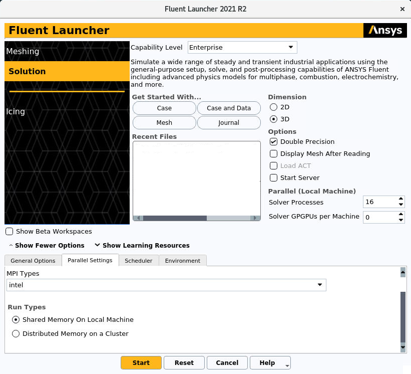
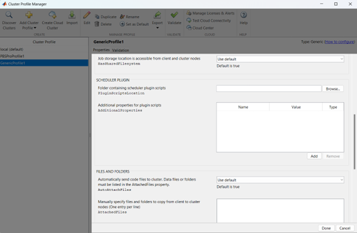

.. _Software:

===================
SOFTWARE
===================

The software installed on the cluster can be installed standalone or installed with modules.

A not-comprehensive list of available software is:

- :ref:`Abaqus<Abaqus>`
- :ref:`Ansys Fluent<AnsysFluent>`
- :ref:`Comsol<Comsol>`
- :ref:`FDS<FDS>`
- :ref:`Matlab<Matlab>`
- :ref:`OpenFOAM<OpenFOAM>`
- :ref:`Python<PythonSection>`
- :ref:`Spack<SpackSection>`

Other software and software versions may be found through *modules* or in the directory ``/software``.

.. _Abaqus:

-------------------------
Abaqus
-------------------------

TBD

.. _AnsysFluent:

-------------------------
Ansys Fluent
-------------------------

This section presents how to start and configure Ansys Fluent on the cluster. The user is expected to have some experience with this CFD code since this user guide covers how to access Ansys Fluent on a single or multiple nodes. 

Launch Fluent from Terminal
--------------------------------

Before launching Ansys Fluent is necessary to enter in the node where the user want to run the simulation.

.. ( nella vecchia guida aggiungeva un “ , as explained in section 4.1 and 4.2”; rimetterlo? Se si, aggiornare a che capitoli a cui fa riferimento)

After the user has logged from the terminal to the node, should go into the folder where the case to be run is located. From this folder the user should launch the command:

    ``/software/ansys_inc/v212/fluent/bin/fluent``
    
    .. ``/fluent``
    
.. ( se si userà l’approccio dei moduli stile cineca, aggiornare mettendo il solo comando e non il path del comando, verificare che sia questo il comando ) 

Parallel run on Single Node set-up 
--------------------------------

If the user wants to make a parallel run just with the processors of a single node, Ansys Fluent should be configurated as follows.
In *Parallel Settings* tab, the voice **Shared Memory On Local Machine** should be selected under the the voice *Run Types*, as can be seen in the following figure:

At the voice *Solver Processes* the user could also select how many cores wants to use.

Parallel run on Multiple Nodes set-up
--------------------------------

If the user wants to make a parallel run with the processors of multiple nodes, Ansys Fluent should be configurated as follows.
In *Parallel Settings* tab, the voice **Distributed Memory On a Cluster** should be selected under the the voice *Run Types*, as can be seen in the next figure.
When **Distributed Memory On a Cluster** is selected, new options appears. Selecting **Machine Names** it is possible to enlist the nodes that the user wants to use, as can be seen in the following figure:

At the voice *Solver Processes* the user could also select how many cores wants to use.
When not explicited, the cores will be equally distributed on the multiple node.
The user can choose how to distribute the cores on the nodes changing from *node-x-y, node-x-z* in figure with *node-x-y:16, node-x-z:16* assunming that the user is working with a total of *32* processors.

Parallel CPU+GPU run set-up
--------------------------------

Management of crashed processes
--------------------------------

When the user starts Ansys Fluent, in the working directory (by default the *path* where you are launching Ansys Fluent) a script named *cleanup-fluent`...`.sh* is created.
If for various reasons Ansys Fluent crashes, typically giving an error message in red color, the Fluent processes could not stop or leave residual processes running. 
You can check it with the *top* or *htop* command. 
In order to clean this processes the user can use the .sh file previously created by launching:
    ``sh cleanup-fluent`...`.sh``
When Ansys Fluent is correctly stopped, the script *cleanup-fluent`...`.sh* is automatically deleted.
This procedure is advised everytime that this script doesn't automatically disappear after closing Ansys Fluent.

.. _Comsol:

-------------------------
Comsol
-------------------------

TBD

.. _FDS:

-------------------------
FDS
-------------------------

TBD

.. _Matlab:

-------------------------
Matlab
-------------------------

`Matlab Software <https://it.mathworks.com>`_ is available on CFDHub.

The software is installed in ``/software/MATLAB``. With ``ls`` in the folder is possible to check which versions are available.

::

    [<username>@nodevg-0-1 ~]$ cd /software/MATLAB
    [<username>@nodevg-0-1 MATLAB]$ ls

*If you are asking for more than one cpu, please make sure your script will use all requested cpus.*

You can use the software in different ways:

- :ref:`batch job on queues<MatlabBatch>`;
- :ref:`interactive job on queues<MatlabInteractive>`;
- :ref:`interactive job on node<MatlabNode>`;
- :ref:`batch job on multiple nodes<MatlabMultipleNodes>`;

.. _MatlabBatch:

Batch job using queues
---------------------------

To submit a Matlab job using queues, prepare the launch file ``matlabJob.sh`` that will be used to run your script. Please check with your :ref:`CFDHub Contact Person<ContactPerson>` what are the ``queues`` you have access to.

The result of the computation will be written on file (please make sure to save all relevant variables). The output will be written on the *jobOutput* file. if you wish you may redirect in another file (``myMatlabOutput``).

*In this case you will not have the graphical interface, so make sure your script does not open any figure, otherwise its execution will stop with errors.*

*If you are asking for more than one cpu, please make sure your script will use all requested cpus.*

::

    #!/bin.bash             # use bash as command interpreter
    #$ -cwd                 # currentWorkingDirectory
    #$ -N myMatlabJob       # jobName
    #$ -j y                 # merges output and errors
    #$ -S /bin/bash         # scripting language
    #$ -l h_rt=1:00:00      # jobDuration hh:mm:ss
    #$ -q hub.q             # queueName
    #$ -pe mpi 2            # cpuNumber
    #________________________________________________________
    
    ### Runs the Matlab "script.m" file.
    ### You may change it to launch your script.
    ### 
    ### Change R2018a with your desired version

    /software/MATLAB/R2018a/bin/matlab -nodesktop -nosplash -r "script"
    # /software/MATLAB/R2018a/bin/matlab -nodesktop -nosplash -r "script" >& myMatlabOutput
    
    ### You may run also a second script
    ### or another software in the same job.
    
    /software/MATLAB/R2018a/bin/matlab -nodesktop -nosplash -r "script2"
    
    echo End Parallel Run

To launch your ``matlabJob.sh`` file you may execute:

``[<username>@nodevg-0-1 jobDirectory]$ qsub matlabJob.sh``

To check how the job is proceeding from the login node, reading the output, you may use:

``[<username>@nodevg-0-1 jobDirectory]$ tail -f myMatlabOutput``

.. _MatlabInteractive:

Interactive job using queues
--------------------------------

To submit an interactive Matlab job using queues, you need to ask one or more cpus to the desired queue. Please check with your :ref:`CFDHub Contact Person<ContactPerson>` what are the ``queues`` you have access to.

*In this case you will not have the graphical interface, so make sure your script does not open any figure, otherwise its execution will stop with errors.*

*If you are asking for more than one cpu, please make sure your script will use all requested cpus.*

You need to follow the :ref:`instructions to launch an interactive job on a queue<InteractiveQueue>`. Be sure to be logged in your login node (``nodevg-0-1`` or ``nodevg-0-2``) and ask to the Job Scheduler your resources:

``qrsh -q hub.q -l h_rt=2:00:00 -l h_vmem=2G -pe mpi 2``

These instructions request on the *hub.q* queue (``-q hub.q``) 2 cpus (``-pe mpi 2``) for 2 hours (``-l h_rt=2:00:00``, hh:mm:ss) and 2GB of RAM (``-l h_vmem=2G``).
You can adjust the request according to your need.

As reported in the :ref:`instructions to launch an interactive job<InteractiveQueue>` you may prepare an alias as well.

The result of the computation will be written on file (please make sure to save all relevant variables). The output will be written on the *jobOutput* file. if you wish you may redirect in another file (``myMatlabOutput``).

You will be then redirected on a node, ready to start your computation:

::

    [<username>@nodevg-0-1 ~]$ qrsh -q hub.q -l h_rt=2:00:00 -l h_vmem=2G -pe mpi 2
    ... wait for node assigment
    [<username>@<node> ~]$
    ... node assigned
    [<username>@<node> ~]$ cd myScriptDir
    [<username>@<node> myScriptDir]$ /software/MATLAB/R2018a/bin/matlab -nodesktop -nosplash -r "script"
    [<username>@<node> myScriptDir]$ /software/MATLAB/R2018a/bin/matlab -nodesktop -nosplash -r "script" >& myMatlabOutput &

You will be running the script "script.m" using Matlab R2018a.

To check how the job is proceeding when writing the output to file you may use:

``[<username>@<node> myScriptDir]$ tail -f myMatlabOutput``

.. _MatlabNode:

Interactive job on a node
-------------------------------

To submit an interactive Matlab job on a node, you need to login on a node. Please check with your :ref:`CFDHub Contact Person<ContactPerson>` what are the ``nodes`` you have access to.

*If you are asking for more than one cpu, please make sure your script will use all requested cpus.*

You need to follow the :ref:`instructions to launch an interactive job on a node<InteractiveNode>`. Be sure to be logged in your login node (``nodevg-0-1`` or ``nodevg-0-1``) and check if your desired node is free.

Once you logged in a node, you may run your script:

::

    [<username>@nodevg-0-1 ~]$ ssh <node>
    [<username>@nodevg-0-1 ~]$ cd myFolder
    [<username>@<node> myFolder]$ /software/MATLAB/R2018a/bin/matlab -nodesktop -nosplash -r "script"``

.. _MatlabMultipleNodes:

Batch job on multiple nodes
-------------------------------

This guide is intended to guide the user through the submission of a Matlab job on multiple nodes.

Up to now, it was possible to launch a Matlab job on a single node (using all or a part of the available cores on the nodes) using the ‘local’ profile to start a Matlab parpool.
However, the job failed if it was asked to run on multiple nodes.

The solution to this problem is to create a new Matlab Cluster configuration.

To do so, it is necessary to: 

1.	Go in the Home tab, click on Parallel -> Create and Manage Clusters (under Environment);

2.	In the Cluster Profile Manager, click on Add Cluster Profile -> Generic;

3.	In the Cluster Profile Manager, select the newly created Generic Profile and select Edit (down on the right of the Cluster Profile Manager windows);

4.	Now you can insert a description of the Cluster, specify the NumWorkers property by setting it to 320 (max number of workers that can be required by the user) and fill the Plugin Scripts Location query. Select browse to specify the folder where you have the matlab plugin script for sun grid engine (i.e.: ‘/global-scratch/bulk-pool/USER_XX/matlab-parallel-gridengine-plugin’). Fill the Additional Properties query by indicating as Value for the Name “Queue” the corresponding queue where you want to submit the job (i.e.: mecc4.q, mecc2.q, cfdguest.q, all.q, hub.q, etc…). By default, if no queue is indicated, the job will run on “mecc4.q”. Click Done (down on the right of the Cluster Profile Manager window);

**T.B.N.: The ad-hoc version of the matlab-parallel-gridengine-plugin folder has to be requested to the system administrator of your section (the version that you can find online had to be changed to ensure compatibility with the CFDHUB cluster).**

5.	Now it is possible to perform the validation of the newly created Generic Profile. Select the Validation tab in the Cluster Profile Manager, deselect SPMD job test, choose the number of workers to use for the validation (of course, select a number of workers-cores big enough so as to have two or more nodes working) and click on Validate to test the profile (down on the right of the Cluster Profile Manager window). If one of the tests failed, please contact the system administrator.

If everything went fine, you are now able to launch Matlab jobs on multiple nodes.

The whole procedure could be performed both using the Matlab GUI or working directly from the matlab terminal (programmatically, please refer to the mathworks site if you chose to use this option).

Of course, when starting the parpool it will be mandatory to specify that now we want to use the newly created Generic Profile, followed by the number of workers that we want to use.

i.e.: 	``parpool(‘GenericProfile’,80)``

::

    p = gcp('nocreate');
    if isempty(p)
        myPC = parcluster('Gen1');
        myPC.AdditionalProperties.Queue = 'mecc4.q';
        parpool(myPC,80);
    end
        
Moreover, if the script/function that we intend to run in parallel on multiple nodes relies on other scripts/functions created by the user, it is necessary to specify such files and paths in the “Attached Files” and “Additional Paths” quey in the Cluster Profile Manager (of course, the same could be done programmatically).

.. _OpenFOAM:

-------------------------
OpenFOAM
-------------------------

OpenFOAM is available on CFDHub.

All three OpenFOAM versions are available:

- `OpenFOAM by ESI <https://www.openfoam.com>`_;
- `FOAM-Extend Project <https://foam-extend.sourceforge.io>`_;
- `OpenFOAM-Foundation <https://openfoam.org>`_;

The software is available through modules. 
To make the system aware of OpenFOAM modules using the relevant module (``module use ...``), looking for the relevant version (``module avail``) and loading the choosen version (``module load ...``):

::

    module use /software/modulefiles/CFD
    module avail
    module load openfoam-v2106

Sometimes you may find an issue to run OpenFOAM in parallel (*bash: mpirun: command not found...*). To solve the problem, yo need to load openmpi using:

::

    module use /software/modulefiles/parallel/
    module load openmpi-4.1.3-gcc.7.3.0

To check that you correctly loaded OpenFOAM, you can run the following command, verifying that the system recognizes the solver (*simpleFOAM* is available for all OpenFOAM versions) and it will tell you where it is located (to check that the correct version of OpenFOAM is loaded, *OpenFOAM-8* in this case):

::

    [<username>@nodevg-0-1 ~]$ which simpleFoam
    /software/OpenFOAM/OpenFOAM-8/platforms/linux64GccDPInt32Opt/bin/simpleFoam

*If you require to launch a job with many cpus please verify the scalability of your simulation (OpenFOAM generally scales well up to 100.000 cells per core), but please verify your setup. Since the cluster is used by many users please check the availability of cpus.*

You can use the software in different ways:

- :ref:`batch job on queues<OpenFOAMBatch>`;
- :ref:`interactive job on queues<OpenFOAMInteractive>`;
- :ref:`interactive job on node<OpenFOAMNode>`.

.. _OpenFOAMBatch:

Batch job using queues
---------------------------

To submit a OpenFOAM job using queues, prepare the launch file ``OpenFOAMJob.sh`` that will be used to run your script. Please check with your :ref:`CFDHub Contact Person<ContactPerson>` what are the ``queues`` you have access to.

The result of the computation will be written on file according to what you specified in your ``system/controlDict`` file. The output will be written on the *jobOutput* file. if you wish you may redirect in another file (typically ``log.$solver``).

*If you are asking for more than one cpu, please make sure your requested cpus and the number of *processors* are coincident, so you will use all requested cpus.*

Here an example of launch file:

::

    #!/bin.bash             # use bash as command interpreter
    #$ -cwd                 # currentWorkingDirectory
    #$ -N myOpenFOAMJob     # jobName
    #$ -j y                 # merges output and errors
    #$ -S /bin/bash         # scripting language
    #$ -l h_rt=3:00:00      # jobDuration hh:mm:ss
    #$ -q hub.q             # queueName
    #$ -pe mpi 4            # cpuNumber
    #---------------------------------------------------------
    
    ### LOAD THE OPENFOAM ENVIRONMENT
    module use /software/modulefiles/CFD
    module load openfoam-v2106
    
    # module use /software/modulefiles/parallel/     # if necessary
    # module load openmpi-4.1.3-gcc.7.3.0            # if necessary
    
    #---------------------------------------------------------
    
    ### EXECUTE COMMANDS
    #./Allrun
    
    blockMesh >& log.blockMesh
    decomposePar >& log.decomposePar
    mpirun --hostfile machinefile.$JOB_ID snappyHexMesh -parallel >& log.snappyHexMesh
    mpirun --hostfile machinefile.$JOB_ID simpleFoam -parallel >& log.simpleFoam
    reconstructPar -latestTime >& log.reconstructPar
    sample -latestTime >& log.sample

    echo End Parallel Run

Just add/remove *hashtags* [#] to comment/uncomment the lines. To execute the commands, you may either include an executable file (``Allrun`` in this case), or list all relevant commands.

To launch your ``OpenFOAMJob.sh`` file from the *login node*, from the ``jobDirectory`` you may execute:

``[<username>@nodevg-0-x jobDirectory]$ qsub OpenFOAMJob.sh``

To check the status of the job you may use the ``qstat -u <username>`` command to see if the job started. To check how the job is proceeding from the login node, reading the output, you may use:

``[<username>@nodevg-0-1 jobDirectory]$ tail -f log.simpleFoam``

.. _OpenFOAMInteractive:

Interactive job using queues
--------------------------------

To submit an interactive OpenFOAM job using queues, you need to ask one or more cpus to the desired queue. Please check with your :ref:`CFDHub Contact Person<ContactPerson>` what are the ``queues`` you have access to.

*If you are asking for more than one cpu, please make sure your script will use all requested cpus.*

You need to follow the :ref:`instructions to launch an interactive job on a queue<InteractiveQueue>`. Be sure to be logged in your login node (``nodevg-0-1`` or ``nodevg-0-2``) and ask to the Job Scheduler your resources:

``qrsh -q hub.q -l h_rt=2:00:00 -l h_vmem=2G -pe mpi 2``

These instructions request on the *hub.q* queue (``-q hub.q``) 2 cpus (``-pe mpi 2``) for 2 hours (``-l h_rt=2:00:00``, hh:mm:ss) and 2GB of RAM (``-l h_vmem=2G``).
You can adjust the request according to your need.

As reported in the :ref:`instructions to launch an interactive job<InteractiveQueue>` you may prepare an alias as well.

To make an interactive OpenFOAM job you will need to ask some computational resources ``qrsh -q ...``, load the OpenFOAM environment sourcing the bashrc or loading the module (eventually verifying that everything works correctly ``which simpleFoam``) and then start with the interactive job:

::

    [<username>@nodevg-0-1 ~]$ qrsh -q hub.q -l h_rt=2:00:00 -l h_vmem=2G -pe mpi 2
    ... wait for node assigment
    [<username>@<node> ~]$
    ... node assigned
    [<username>@<node> ~]$ module use /software/modulefiles/CFD
    [<username>@<node> ~]$ module load openfoam-v8
    # [<username>@<node> ~]$ module use /software/modulefiles/parallel/     # if necessary
    # [<username>@<node> ~]$ module load openmpi-4.1.3-gcc.7.3.0            # if necessary
    [<username>@<node> ~]$ which simpleFoam
    /software/OpenFOAM/OpenFOAM-8/platforms/linux64GccDPInt32Opt/bin/simpleFoam
    [<username>@<node> ~]$ cd myJobFolder
    [<username>@<node> myJobFolder]$ blockMesh
    [<username>@<node> myScriptDir]$ blockMesh >& log.blockMesh &
    [<username>@<node> myScriptDir]$ tail -f log.blockMesh

You will be running *blockMesh* using *OpenFOAM-8*.

Two ways of running are reported: in the first you will see what the solver is foreground; in the second the solver will run in background (see tailing ``&``) writing to file the output.

.. _OpenFOAMNode:

Interactive job on a node
-------------------------------

To submit an interactive OpenFOAM job on a node, you need to login on a node. Please check with your :ref:`CFDHub Contact Person<ContactPerson>` what are the ``nodes`` you have access to.

You need to follow the :ref:`instructions to launch an interactive job on a node<InteractiveNode>`. Be sure to be logged in your login node (``nodevg-0-1`` or ``nodevg-0-1``) and check if your desired node is free.

Once you logged in a node, load the OpenFOAM environment sourcing the bashrc or loading the module (eventually verifying that everything works correctly ``which simpleFoam``) and then start with the interactive job:

::

    [<username>@nodevg-0-1 ~]$ ssh <node>
    [<username>@<node> ~]$ module use /software/modulefiles/CFD
    [<username>@<node> ~]$ module load openfoam-v8
    # [<username>@<node> ~]$ module use /software/modulefiles/parallel/     # if necessary
    # [<username>@<node> ~]$ module load openmpi-4.1.3-gcc.7.3.0            # if necessary
    [<username>@<node> ~]$ which simpleFoam
    /software/OpenFOAM/OpenFOAM-8/platforms/linux64GccDPInt32Opt/bin/simpleFoam
    [<username>@<node> ~]$ cd myJobFolder
    [<username>@<node> myJobFolder]$ blockMesh
    [<username>@<node> myScriptDir]$ blockMesh >& log.blockMesh &
    [<username>@<node> myScriptDir]$ tail -f log.blockMesh

You will be running *blockMesh* using *OpenFOAM-8*.

Two ways of running are reported: in the first you will see what the solver is foreground; in the second the solver will run in background (see tailing ``&``) writing to file the output.

.. _PythonSection:

-------------------------
Python
-------------------------

`Python <https://www.python.org>`_ is available on CFDHub.

The software is available in Linux OS.

You can use the software in different ways:

- :ref:`batch job on queues<PythonBatch>`;
- :ref:`interactive job on queues<PythonInteractive>`;
- :ref:`interactive job on node<PythonNode>`.

.. _PythonBatch:

Batch job using queues
---------------------------

To submit a Python job using queues, prepare the launch file ``PythonJob.sh`` that will be used to run your script. Please check with your :ref:`CFDHub Contact Person<ContactPerson>` what are the ``queues`` you have access to.

The result of the computation will be written on file (please make sure to save all relevant variables). The output will be written on the *jobOutput* file. if you wish you may redirect in another file (``myPythonOutput``).

*If you are asking for more than one cpu, please make sure your requested cpus and the number of *processors* are coincident, so you will use all requested cpus.*

Here an example of launch file:

::

    #!/bin.bash             # use bash as command interpreter
    #$ -cwd                 # currentWorkingDirectory
    #$ -N myPythonJob       # jobName
    #$ -j y                 # merges output and errors
    #$ -S /bin/bash         # scripting language
    #$ -l h_rt=2:00:00      # jobDuration hh:mm:ss
    #$ -q hub.q             # queueName
    #$ -pe mpi 2            # cpuNumber
    #---------------------------------------------------------
    
    ### EXECUTE COMMANDS
    python myPythonScript >& myPythonOutput
    
    echo End Parallel Run

.. _PythonInteractive:

Interactive job using queues
--------------------------------

To submit an interactive Python job using queues, you need to ask one or more cpus to the desired queue. Please check with your :ref:`CFDHub Contact Person<ContactPerson>` what are the ``queues`` you have access to.

You need to follow the :ref:`instructions to launch an interactive job on a queue<InteractiveQueue>`. Be sure to be logged in your login node (``nodevg-0-1`` or ``nodevg-0-2``) and ask to the Job Scheduler your resources:

``qrsh -q hub.q -l h_rt=2:00:00 -l h_vmem=2G -pe mpi 2``

These instructions request on the *hub.q* queue (``-q hub.q``) 2 cpus (``-pe mpi 2``) for 2 hours (``-l h_rt=2:00:00``, hh:mm:ss) and 2GB of RAM (``-l h_vmem=2G``).
You can adjust the request according to your need.

As reported in the :ref:`instructions to launch an interactive job<InteractiveQueue>` you may prepare an alias as well.

To make an interactive Python job you will need to ask some computational resources ``qrsh -q ...``, and then start with the interactive job which may be with a script or directly writing commands:

::

    [<username>@nodevg-0-1 ~]$ qrsh -q hub.q -l h_rt=2:00:00 -l h_vmem=2G -pe mpi 2
    ... wait for node assigment
    [<username>@<node> ~]$
    ... node assigned
    [<username>@<node> ~]$ cd myJobFolder
    [<username>@<node> myJobFolder]$ python myPythonScript.py
    [<username>@<node> ~]$ python
    Python 2.6.6 (r266:84292, Nov 22 2013, 12:16:22)
    [GCC 4.4.7 20120313 (Red Hat 4.4.7-4)] on linux2
    Type "help", "copyright", "credits" or "license" for more information.
    >>>

Two ways of running are reported: in the first you are running your *myPythonScript*; in the second you are writing the instructions to python.

.. _PythonNode:

Interactive job on a node
--------------------------------

To submit an interactive OpenFOAM job on a node, you need to login on a node. Please check with your :ref:`CFDHub Contact Person<ContactPerson>` what are the ``nodes`` you have access to.

You need to follow the :ref:`instructions to launch an interactive job on a node<InteractiveNode>`. Be sure to be logged in your login node (``nodevg-0-1`` or ``nodevg-0-1``) and check if your desired node is free.

To make an interactive Python job you will need to ask some computational resources ``qrsh -q ...``, and then start with the interactive job which may be with a script or directly writing commands:

::

    [<username>@nodevg-0-1 ~]$ ssh <node>
    [<username>@<node> ~]$ cd myJobFolder
    [<username>@<node> myJobFolder]$ python myPythonScript.py
    [<username>@<node> ~]$ python
    Python 2.6.6 (r266:84292, Nov 22 2013, 12:16:22)
    [GCC 4.4.7 20120313 (Red Hat 4.4.7-4)] on linux2
    Type "help", "copyright", "credits" or "license" for more information.
    >>>

Two ways of running are reported: in the first you are running your *myPythonScript*; in the second you are writing the instructions to python.

.. _SpackSection:

-------------------------
Spack
-------------------------

`Spack <https://spack.readthedocs.io/en/latest/>`_  is a package management tool designed to support multiple versions and configurations of software on a wide variety of platforms and environments: it is non-destructive, therefore installing a new version does not break existing installations, so many configurations can coexist on the same system.

You can download and setup Spack by cloning it from the Github repository (it is suggested that you do it in your /global-scratch/bulk_pool/$USER folder, as it may fill up your $HOME folder rather quickly):

.. code-block:: console

   git clone -c feature.manyFiles=true https://github.com/spack/spack.git
   
This will create a directory called spack; in order to use it, you need to add the following command to your .bashrc file, and the source it:

.. code-block:: console

   . /global-scratch/bulk_pool/$USER/spack/share/spack/setup-env.sh
   
or you can create an alias to be placed with your aliases:

.. code-block:: console
   alias loadSpack='. /global-scratch/bulk_pool/$USER/spack/share/spack/setup-env.sh'

To load spack you may just digit ``loadSpack``.
   
Spack, by default, will store test, cache and source files outside of your scratch folder, which might fill up all the available space; it is suggested that you create a folder in your main spack directory (for example ``tmp``), and then edit the config.yaml file found in /spack/etc/spack/defaults, so that it will save those files inside of the folder you made:

.. code-block:: none

   vi config.yaml
   
   build_stage:
    - $tempdir/$user/spack-stage  becomes  - $spack/<new_folder>/spack-stage
    - $user_cache_path/stage  becomes  - $spack/var/spack/stage
    
   test_stage: $user_cache_path/test  becomes  test_stage: $spack/<new_folder>/test
   
   misc_cache: $user_cache_path/cache  becomes  misc_cache: $spack/<new_folder>/cache
   
When installing a software, a compiler must be loaded into Spack; by default, CentOS 7 uses gcc 4.8.5, which is quite outdated, therefore it is suggested to load your preferred version of gcc (for the following tutorial, we'll use 9.3.0):

.. code-block:: console

   module use /software/modulefiles/compilers
   module avail
   module load gcc-9.3.0
   spack compiler find

You can also install gcc:

.. code-block:: console

   spack install gcc
   spack compiler find
   
To list all the compilers:

.. code-block:: console
   
   spack compilers

.. _SpackTutorial:

Tutorial
---------------------------

The main functionalities of Spack will be explained through the installation of `AmgX <https://github.com/NVIDIA/AMGX>`_, which is a GPU accelerated core solver library that speeds up computationally intense linear solver portion of simulations made by NVIDIA.

Before starting, AmgX requires CUDA, which is a parallel computing platform and programming model developed by NVIDIA for general computing on GPUs; CUDA is already installed on CFD-HUB, and can be used by editing and sourcing your .bashrc file:

.. code-block:: none

   export PATH="/usr/local/cuda/bin:$PATH"
   export LD_LIBRARY_PATH="/usr/local/cuda/lib64:$LD_LIBRARY_PATH"
   
You can check the current version of CUDA by:

.. code-block:: console

   nvcc --version

A useful command to check installation options and information about a certain software is:

.. code-block:: console

   spack info --all amgx
   
To see a list of all the dependencies which will be installed, along with information about the version and which compilers will be used, you can type:

.. code-block:: console

   spack spec amgx
   
Here, by checking the list of dependencies, we can see that spack will try to install a newer version of CUDA, which is however incompatible with the NVIDIA drivers installed on the cluster, therefore we'll have to specify to spack that we want to use the version of CUDA which is already installed on the system, which can be done by editing the file ``/spack/etc/spack/defaults/packages.yaml``: and adding under "packages" the cuda specifications:

.. code-block:: none

   packages:
    cuda:
     externals:
     - spec: cuda@11.2%gcc@9.3.0
       prefix: /usr/local/cuda
     buildable: false

Also, Spack will try to install an outdated version of AmgX, which is incompatible with CUDA 11.2, so we'll have to edit the package.py file found at ``/spack/var/spack/repos/builtin/packages/amgx``; it should look like this (edit just the url and add the new version):

.. code-block:: none

   url = "https://github.com/NVIDIA/AMGX/archive/refs/tags/v2.3.0.tar.gz"
   version("2.3.0", url="https://github.com/NVIDIA/AMGX/archive/refs/tags/v2.3.0.tar.gz")
   
Now we are ready to install AmgX: we want to specify that we want version 2.3.0, compiled with gcc version 9.3.0, which can be done by typing amgx@2.3.0%gcc@9.3.0 (@ specifies the version, % specifies the compiler).

Spack however requires that, for each package built with CUDA (including dependencies), you specify which architecture the GPU is built on, and this can be done by typing cuda_arch=70.

If we want to use AmgX with MPI, we also need to specify that both OpenMPI and HWLOC use CUDA, which can be done by typing ^openmpi@4.1.5+cuda (spack might try to install an older version of OpenMPI, so we'll specify the newer one) and ^hwloc+cuda (^ specifies which dependency you want to install, + indicates which additional installation options you want to add).

Additional options about the installation process must be added: in our case, because we're downloading the source from a link we provided ourselves, we need to add --no-checksum; also, AmgX source files must be kept in our spack-stage folder (wherever you specified it), so we'll add --keep-stage.

The command should look like this:

.. code-block:: console

   spack install --no-checksum --keep-stage amgx@2.3.0%gcc@9.3.0 cuda_arch=70 ^openmpi@4.1.5+cuda cuda_arch=70 ^hwloc+cuda cuda_arch=70 > log.amgx230_gcc930 &

A good practice is to write this command to a file (eventually named ``amgx230_gcc930``) so you can keep track of the submitted command and track of the log file. To submit the command just type ``./amgx230_gcc930`` and you will be able to read the log file by typing ``tail -f log.amgx230_gcc930``. You can use these files in a separated folder (for example "installations").
   
To verify that the amgx installation works, copy the file matrix.mtx located in /spack-stage/<amgx-stage>/spack-src/examples (your source folder) to the folder spack/opt/spack/linux-centos7-cascadelake/gcc-9.3.0/<amgx>/lib/examples, then move to folder spack/opt/spack/linux-centos7-cascadelake/gcc-9.3.0/<amgx>/lib (your installation folder) and type:

.. code-block:: console
   
   examples/amgx_capi -m examples/matrix.mtx -c configs/core/CG_DILU.json
   
Below, a list of useful commands:

.. code-block:: console

   spack uninstall <package_name> # uninstalls package
   spack load <package_name> # you might need to load a software before using it
   spack env create <env_name> # creates environment, useful when dealing with a large number of installations with multiple compilers
   spack env list # lists all environments
   spacktivate <env_name> # activates environment
   spack env status # shows current environment
   despacktivate # deactivates environment
   spack add <package_name> # adds package to current environment, must be done before installation
   spack remove <package_name> # removes package from current environment, must be done before uninstallation
   spack find -ldf # lists all the installed packages, showing how the dependencies are linked
